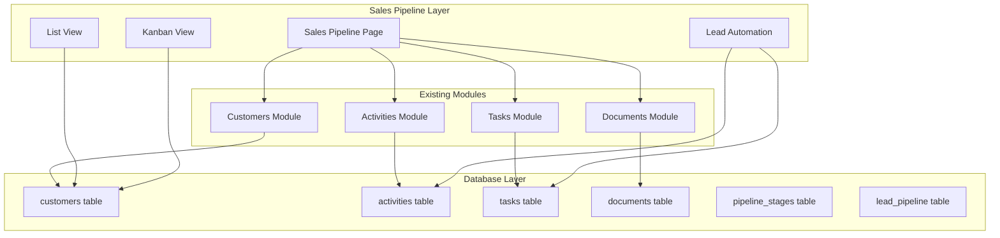

# Design Document: Sales Pipeline System

## Overview

سیستم پیگیری فروش (Sales Pipeline) یک لایه اتوماسیون و منطقی است که ماژول‌های موجود CRM را به هم متصل می‌کند. این سیستم به جای ایجاد ماژول مستقل جدید، از ماژول‌های موجود استفاده کرده و یک رابط کاربری یکپارچه برای مدیریت فرآیند فروش ارائه می‌دهد.

### اصول طراحی:
- **عدم تکرار**: استفاده مجدد از ماژول‌های موجود
- **یکپارچگی**: حفظ consistency در تمام سیستم
- **قابلیت گسترش**: امکان افزودن مراحل جدید فروش
- **اتوماسیون هوشمند**: کاهش کار دستی و افزایش کارایی

## Architecture

### معماری کلی سیستم



### ساختار داده‌ها

#### 1. تغییرات جدول customers
```sql
-- افزودن فیلد type به جدول موجود
ALTER TABLE customers ADD COLUMN type ENUM('lead', 'customer') DEFAULT 'lead' AFTER lifecycle_stage;

-- افزودن فیلدهای pipeline
ALTER TABLE customers ADD COLUMN current_pipeline_stage VARCHAR(50) DEFAULT 'new_lead' AFTER type;
ALTER TABLE customers ADD COLUMN deal_value DECIMAL(15,2) DEFAULT NULL AFTER potential_value;
ALTER TABLE customers ADD COLUMN success_probability INT DEFAULT 50 AFTER deal_value;
ALTER TABLE customers ADD COLUMN sales_owner VARCHAR(36) DEFAULT NULL AFTER assigned_to;
ALTER TABLE customers ADD COLUMN last_followup_date TIMESTAMP NULL AFTER last_interaction;
ALTER TABLE customers ADD COLUMN next_action_date TIMESTAMP NULL AFTER last_followup_date;
ALTER TABLE customers ADD COLUMN lead_temperature ENUM('hot', 'warm', 'cold') DEFAULT 'warm' AFTER lead_score;
ALTER TABLE customers ADD COLUMN loss_reason TEXT NULL AFTER lead_temperature;
```

#### 2. جدول مراحل pipeline (اختیاری - برای قابلیت تنظیم)
```sql
CREATE TABLE pipeline_stages (
    id VARCHAR(36) PRIMARY KEY DEFAULT (UUID()),
    tenant_key VARCHAR(50) DEFAULT 'rabin',
    name VARCHAR(100) NOT NULL,
    display_name VARCHAR(100) NOT NULL,
    stage_order INT NOT NULL,
    is_active BOOLEAN DEFAULT TRUE,
    created_at TIMESTAMP DEFAULT CURRENT_TIMESTAMP,
    updated_at TIMESTAMP DEFAULT CURRENT_TIMESTAMP ON UPDATE CURRENT_TIMESTAMP
);

-- مراحل پیش‌فرض
INSERT INTO pipeline_stages (name, display_name, stage_order) VALUES
('new_lead', 'سرنخ جدید', 1),
('contacted', 'تماس اولیه', 2),
('needs_analysis', 'نیازسنجی', 3),
('proposal_sent', 'ارسال پیشنهاد', 4),
('negotiation', 'مذاکره', 5),
('closed_won', 'برنده شده', 6),
('closed_lost', 'از دست رفته', 7);
```

#### 3. جدول تاریخچه pipeline
```sql
CREATE TABLE lead_pipeline_history (
    id VARCHAR(36) PRIMARY KEY DEFAULT (UUID()),
    tenant_key VARCHAR(50) DEFAULT 'rabin',
    customer_id VARCHAR(36) NOT NULL,
    from_stage VARCHAR(50),
    to_stage VARCHAR(50) NOT NULL,
    changed_by VARCHAR(36) NOT NULL,
    change_reason TEXT,
    changed_at TIMESTAMP DEFAULT CURRENT_TIMESTAMP,
    FOREIGN KEY (customer_id) REFERENCES customers(id) ON DELETE CASCADE
);
```

## Components and Interfaces

### 1. Sales Pipeline Page Component

```typescript
interface SalesPipelinePageProps {
  tenantKey: string;
}

interface Lead {
  id: string;
  name: string;
  email?: string;
  phone?: string;
  company_name?: string;
  type: 'lead' | 'customer';
  current_pipeline_stage: string;
  deal_value?: number;
  success_probability: number;
  sales_owner?: string;
  last_followup_date?: string;
  next_action_date?: string;
  lead_temperature: 'hot' | 'warm' | 'cold';
  created_at: string;
  updated_at: string;
}

interface PipelineStage {
  id: string;
  name: string;
  display_name: string;
  stage_order: number;
  leads: Lead[];
}
```

### 2. Kanban View Component

```typescript
interface KanbanViewProps {
  stages: PipelineStage[];
  onStageChange: (leadId: string, newStage: string) => Promise<void>;
  onLeadClick: (lead: Lead) => void;
}

interface LeadCard {
  lead: Lead;
  onDragStart: (e: DragEvent) => void;
  onDragEnd: (e: DragEvent) => void;
  onClick: () => void;
}
```

### 3. List View Component

```typescript
interface ListViewProps {
  leads: Lead[];
  onSort: (column: string, direction: 'asc' | 'desc') => void;
  onFilter: (filters: LeadFilters) => void;
  onBulkAction: (action: string, leadIds: string[]) => void;
}

interface LeadFilters {
  stage?: string;
  temperature?: 'hot' | 'warm' | 'cold';
  owner?: string;
  dateRange?: {
    from: string;
    to: string;
  };
}
```

### 4. Lead Automation Service

```typescript
interface LeadAutomationService {
  calculateTemperature(lead: Lead): 'hot' | 'warm' | 'cold';
  checkFollowUpAlerts(): Promise<Alert[]>;
  createStageChangeTask(leadId: string, newStage: string): Promise<void>;
  convertLeadToCustomer(leadId: string): Promise<void>;
  logStageChange(leadId: string, fromStage: string, toStage: string, userId: string): Promise<void>;
}
```

## Data Models

### Extended Customer Model

```typescript
interface ExtendedCustomer extends Customer {
  // فیلدهای جدید
  type: 'lead' | 'customer';
  current_pipeline_stage: string;
  deal_value?: number;
  success_probability: number;
  sales_owner?: string;
  last_followup_date?: string;
  next_action_date?: string;
  lead_temperature: 'hot' | 'warm' | 'cold';
  loss_reason?: string;
  
  // روابط با ماژول‌های موجود
  activities?: Activity[];
  tasks?: Task[];
  documents?: Document[];
  pipeline_history?: PipelineHistoryEntry[];
}

interface PipelineHistoryEntry {
  id: string;
  from_stage?: string;
  to_stage: string;
  changed_by: string;
  change_reason?: string;
  changed_at: string;
}
```

### Pipeline Configuration Model

```typescript
interface PipelineConfiguration {
  stages: PipelineStage[];
  automations: AutomationRule[];
  notifications: NotificationRule[];
}

interface AutomationRule {
  id: string;
  trigger: 'stage_change' | 'time_based' | 'interaction';
  condition: string;
  action: 'create_task' | 'send_alert' | 'update_field';
  parameters: Record<string, any>;
}
```

## API Design

### 1. Sales Pipeline API Endpoints

```typescript
// GET /api/tenant/sales-pipeline
interface GetPipelineResponse {
  success: boolean;
  data: {
    stages: PipelineStage[];
    leads: Lead[];
    stats: PipelineStats;
  };
}

// PUT /api/tenant/sales-pipeline/lead/:id/stage
interface UpdateLeadStageRequest {
  new_stage: string;
  reason?: string;
}

// GET /api/tenant/sales-pipeline/lead/:id/details
interface GetLeadDetailsResponse {
  success: boolean;
  data: {
    lead: ExtendedCustomer;
    activities: Activity[];
    tasks: Task[];
    documents: Document[];
    pipeline_history: PipelineHistoryEntry[];
  };
}

// POST /api/tenant/sales-pipeline/lead/:id/convert
interface ConvertLeadRequest {
  sale_amount?: number;
  notes?: string;
}
```

### 2. Integration with Existing APIs

```typescript
// استفاده از API های موجود
// GET /api/tenant/customers - برای دریافت لیست leads
// GET /api/tenant/activities - برای timeline
// GET /api/tenant/tasks - برای وظایف
// GET /api/tenant/documents - برای اسناد
```

## User Interface Design

### 1. Sales Pipeline Page Layout

```
┌─────────────────────────────────────────────────────────────┐
│ Sales Pipeline - مرکز کنترل فروش                           │
├─────────────────────────────────────────────────────────────┤
│ [Kanban View] [List View] [Analytics]    [+ New Lead]      │
├─────────────────────────────────────────────────────────────┤
│ Filters: [Stage ▼] [Owner ▼] [Temperature ▼] [Date Range]  │
├─────────────────────────────────────────────────────────────┤
│                                                             │
│ ┌─────────┐ ┌─────────┐ ┌─────────┐ ┌─────────┐ ┌─────────┐ │
│ │سرنخ جدید│ │تماس اولیه│ │نیازسنجی │ │ پیشنهاد │ │ مذاکره  │ │
│ │   (5)   │ │   (3)   │ │   (2)   │ │   (4)   │ │   (1)   │ │
│ ├─────────┤ ├─────────┤ ├─────────┤ ├─────────┤ ├─────────┤ │
│ │ Lead 1  │ │ Lead 6  │ │ Lead 9  │ │ Lead 12 │ │ Lead 15 │ │
│ │ 🔥 Hot  │ │ 🟡 Warm │ │ ❄️ Cold │ │ 🔥 Hot  │ │ 🟡 Warm │ │
│ │ 50M ت   │ │ 30M ت   │ │ 20M ت   │ │ 100M ت  │ │ 75M ت   │ │
│ │ علی     │ │ سارا    │ │ احمد    │ │ فاطمه   │ │ حسن     │ │
│ └─────────┘ └─────────┘ └─────────┘ └─────────┘ └─────────┘ │
│                                                             │
└─────────────────────────────────────────────────────────────┘
```

### 2. Lead Card Design

```
┌─────────────────────────────────┐
│ 🔥 علی احمدی - شرکت رابین        │
├─────────────────────────────────┤
│ 💰 50,000,000 تومان             │
│ 📊 احتمال موفقیت: 75%           │
│ 👤 مسئول: سارا محمدی            │
│ 📅 آخرین تماس: 2 روز پیش       │
│ ⏰ اقدام بعدی: فردا            │
├─────────────────────────────────┤
│ [👁️ مشاهده] [📞 تماس] [✏️ ویرایش] │
└─────────────────────────────────┘
```

### 3. Lead Details Modal

```
┌─────────────────────────────────────────────────────────────┐
│ جزئیات سرنخ: علی احمدی                              [✕]    │
├─────────────────────────────────────────────────────────────┤
│ [اطلاعات کلی] [تایم‌لاین] [وظایف] [اسناد] [تاریخچه]      │
├─────────────────────────────────────────────────────────────┤
│ نام: علی احمدی                    شرکت: شرکت رابین        │
│ ایمیل: ali@rabin.com             تلفن: 09123456789        │
│ مرحله فعلی: نیازسنجی              وضعیت: 🔥 داغ           │
│ مبلغ معامله: 50,000,000 تومان     احتمال: 75%            │
│ مسئول فروش: سارا محمدی           آخرین تماس: 2 روز پیش   │
│                                                             │
│ ┌─ تایم‌لاین فعالیت‌ها ─────────────────────────────────┐   │
│ │ 📞 تماس تلفنی - 2 روز پیش                          │   │
│ │ 📧 ارسال ایمیل - 5 روز پیش                         │   │
│ │ 🤝 جلسه حضوری - 1 هفته پیش                        │   │
│ └─────────────────────────────────────────────────────┘   │
│                                                             │
│ [تغییر مرحله] [افزودن فعالیت] [ایجاد وظیفه] [ذخیره]      │
└─────────────────────────────────────────────────────────────┘
```

## Business Logic

### 1. Lead Temperature Calculation

```typescript
function calculateLeadTemperature(lead: Lead): 'hot' | 'warm' | 'cold' {
  const daysSinceLastInteraction = getDaysSince(lead.last_followup_date);
  const successProbability = lead.success_probability;
  
  // داغ: تعامل اخیر + احتمال بالا
  if (daysSinceLastInteraction <= 1 && successProbability >= 70) {
    return 'hot';
  }
  
  // سرد: عدم پیگیری بیش از 3 روز
  if (daysSinceLastInteraction > 3) {
    return 'cold';
  }
  
  // نیمه‌فعال: سایر موارد
  return 'warm';
}
```

### 2. Stage Change Automation

```typescript
async function handleStageChange(leadId: string, newStage: string, userId: string) {
  // 1. به‌روزرسانی مرحله
  await updateLeadStage(leadId, newStage);
  
  // 2. ثبت در تاریخچه
  await logStageChange(leadId, newStage, userId);
  
  // 3. ایجاد وظیفه پیگیری
  await createFollowUpTask(leadId, newStage);
  
  // 4. بررسی اتوماسیون‌ها
  if (newStage === 'closed_won') {
    await convertLeadToCustomer(leadId);
  }
  
  if (newStage === 'closed_lost') {
    // نیاز به دلیل عدم موفقیت
    await requireLossReason(leadId);
  }
  
  // 5. ثبت فعالیت
  await logActivity(leadId, `مرحله به ${newStage} تغییر کرد`, userId);
}
```

### 3. Alert System

```typescript
async function checkFollowUpAlerts(): Promise<Alert[]> {
  const alerts: Alert[] = [];
  
  // سرنخ‌هایی که بیش از 3 روز پیگیری نشده‌اند
  const overdueLeads = await getOverdueLeads(3);
  
  for (const lead of overdueLeads) {
    alerts.push({
      type: 'warning',
      title: 'سرنخ نیاز به پیگیری دارد',
      message: `${lead.name} بیش از 3 روز پیگیری نشده است`,
      leadId: lead.id,
      priority: lead.lead_temperature === 'hot' ? 'high' : 'medium'
    });
  }
  
  return alerts;
}
```

## Correctness Properties

*A property is a characteristic or behavior that should hold true across all valid executions of a system-essentially, a formal statement about what the system should do. Properties serve as the bridge between human-readable specifications and machine-verifiable correctness guarantees.*

### Property 1: Customer Type Field Validation
*For any* customer record, the type field should only contain values 'lead' or 'customer'
**Validates: Requirements 1.1**

### Property 2: Default Lead Type Assignment
*For any* newly created customer, the default type should be set to 'lead'
**Validates: Requirements 1.2**

### Property 3: Automatic Lead to Customer Conversion
*For any* lead that makes a purchase, the system should automatically change the type from 'lead' to 'customer'
**Validates: Requirements 1.3**

### Property 4: Customer Type Display
*For any* customer in the list interface, the customer type should be displayed
**Validates: Requirements 1.4**

### Property 5: Type-based Filtering
*For any* filter operation by customer type, only customers of the specified type should be returned
**Validates: Requirements 1.5**

### Property 6: Default Stage Assignment
*For any* newly created lead, the pipeline stage should be set to 'new_lead'
**Validates: Requirements 2.2**

### Property 7: Stage History Tracking
*For any* lead stage change, the transition should be recorded in the stage history with proper timestamps
**Validates: Requirements 2.4**

### Property 8: Deal Value Storage
*For any* lead with a deal value, the value should be properly stored and retrievable
**Validates: Requirements 3.1**

### Property 9: Success Probability Validation
*For any* lead success probability, the value should be between 0 and 100 percent
**Validates: Requirements 3.2**

### Property 10: Temperature Calculation - Hot Leads
*For any* lead with recent interaction (≤1 day) and success probability ≥70%, the temperature should be calculated as 'hot'
**Validates: Requirements 4.1**

### Property 11: Temperature Calculation - Cold Leads
*For any* lead with no follow-up for more than 3 days, the temperature should be calculated as 'cold'
**Validates: Requirements 4.3**

### Property 12: Temperature Auto-Update
*For any* lead where interaction data or probability changes, the temperature should be automatically recalculated
**Validates: Requirements 4.4**

### Property 13: Kanban Stage Display
*For any* pipeline stage, it should be displayed as a column in the kanban view
**Validates: Requirements 6.1**

### Property 14: Lead Card Placement
*For any* lead, it should appear as a card in the column corresponding to its current stage
**Validates: Requirements 6.2**

### Property 15: Drag and Drop Stage Update
*For any* lead card dragged to a different stage, the lead's current stage should be updated in the database
**Validates: Requirements 6.3**

### Property 16: Module Integration Consistency
*For any* lead, accessing its details should display consistent data from all integrated modules (customer, activities, tasks, documents)
**Validates: Requirements 8.5**

### Property 17: Follow-up Alert Generation
*For any* lead not followed up for more than 3 days, an alert should be generated
**Validates: Requirements 9.1**

### Property 18: Stage Change Task Creation
*For any* lead stage change, a follow-up task should be automatically created
**Validates: Requirements 9.2**

### Property 19: Closed Won Conversion
*For any* lead marked as 'closed_won', the customer type should automatically change from 'lead' to 'customer'
**Validates: Requirements 9.3**

### Property 20: Loss Reason Requirement
*For any* lead marked as 'closed_lost', a loss reason should be required and stored
**Validates: Requirements 9.4**

### Property 21: Activity Logging
*For any* stage change, the change should be logged as an activity in the Activities_Module
**Validates: Requirements 9.5**

### Property 22: Permission-based Access Control
*For any* user without proper permissions, access to the sales pipeline should be denied
**Validates: Requirements 10.4**

### Property 23: Menu Visibility Control
*For any* unauthorized user, the sales pipeline menu item should not be displayed
**Validates: Requirements 10.5**

## Error Handling

### 1. Database Error Handling

```typescript
interface DatabaseErrorHandler {
  handleConnectionError(): Promise<void>;
  handleConstraintViolation(error: ConstraintError): Promise<ErrorResponse>;
  handleTransactionRollback(error: TransactionError): Promise<void>;
}

// مثال: مدیریت خطای تغییر مرحله
async function handleStageChangeError(leadId: string, newStage: string, error: Error) {
  if (error instanceof ConstraintViolationError) {
    return {
      success: false,
      error: 'مرحله انتخابی معتبر نیست',
      code: 'INVALID_STAGE'
    };
  }
  
  if (error instanceof PermissionError) {
    return {
      success: false,
      error: 'شما مجوز تغییر مرحله این سرنخ را ندارید',
      code: 'PERMISSION_DENIED'
    };
  }
  
  // خطای عمومی
  await logError('stage_change_failed', { leadId, newStage, error: error.message });
  return {
    success: false,
    error: 'خطا در تغییر مرحله سرنخ',
    code: 'STAGE_CHANGE_FAILED'
  };
}
```

### 2. Validation Error Handling

```typescript
interface ValidationErrorHandler {
  validateLeadData(lead: Partial<Lead>): ValidationResult;
  validateStageTransition(fromStage: string, toStage: string): ValidationResult;
  validatePermissions(userId: string, action: string): ValidationResult;
}

// اعتبارسنجی داده‌های سرنخ
function validateLeadData(lead: Partial<Lead>): ValidationResult {
  const errors: string[] = [];
  
  if (lead.success_probability && (lead.success_probability < 0 || lead.success_probability > 100)) {
    errors.push('احتمال موفقیت باید بین 0 تا 100 باشد');
  }
  
  if (lead.deal_value && lead.deal_value < 0) {
    errors.push('مبلغ معامله نمی‌تواند منفی باشد');
  }
  
  if (lead.next_action_date && new Date(lead.next_action_date) < new Date()) {
    errors.push('تاریخ اقدام بعدی نمی‌تواند در گذشته باشد');
  }
  
  return {
    isValid: errors.length === 0,
    errors
  };
}
```

### 3. Integration Error Handling

```typescript
// مدیریت خطاهای ادغام با ماژول‌های موجود
async function handleModuleIntegrationError(module: string, operation: string, error: Error) {
  const errorMap = {
    'activities': 'خطا در دسترسی به فعالیت‌ها',
    'tasks': 'خطا در دسترسی به وظایف',
    'documents': 'خطا در دسترسی به اسناد',
    'customers': 'خطا در دسترسی به اطلاعات مشتری'
  };
  
  await logError('module_integration_error', {
    module,
    operation,
    error: error.message
  });
  
  return {
    success: false,
    error: errorMap[module] || 'خطا در دسترسی به ماژول',
    code: 'MODULE_INTEGRATION_ERROR'
  };
}
```

### 4. UI Error Handling

```typescript
interface UIErrorHandler {
  handleDragDropError(error: Error): void;
  handleFilterError(error: Error): void;
  handleExportError(error: Error): void;
}

// مدیریت خطاهای رابط کاربری
function handleUIError(error: Error, context: string) {
  const userFriendlyMessages = {
    'drag_drop_failed': 'خطا در جابجایی سرنخ. لطفاً دوباره تلاش کنید.',
    'filter_failed': 'خطا در اعمال فیلتر. لطفاً صفحه را بازخوانی کنید.',
    'export_failed': 'خطا در خروجی گیری. لطفاً دوباره تلاش کنید.',
    'load_failed': 'خطا در بارگذاری اطلاعات. لطفاً صفحه را بازخوانی کنید.'
  };
  
  // نمایش پیام خطا به کاربر
  showErrorToast(userFriendlyMessages[context] || 'خطای غیرمنتظره رخ داده است');
  
  // ثبت خطا برای بررسی
  logClientError(context, error.message);
}
```

## Testing Strategy

### Dual Testing Approach

این سیستم از دو رویکرد تست استفاده می‌کند:

- **Unit Tests**: تست موارد خاص، edge cases و شرایط خطا
- **Property-Based Tests**: تست خصوصیات کلی سیستم با ورودی‌های تصادفی

هر دو نوع تست مکمل یکدیگر هستند و برای پوشش جامع ضروری‌اند.

### Property-Based Testing Configuration

- **Testing Library**: Jest با fast-check برای property-based testing
- **Minimum Iterations**: 100 تکرار برای هر property test
- **Test Tagging**: هر property test با کامنت مرجع به property طراحی

### Unit Testing Focus Areas

**Unit tests باید روی موارد زیر متمرکز شوند:**
- مثال‌های خاص که رفتار صحیح را نشان می‌دهند
- Edge cases و شرایط خطا
- نقاط ادغام بین کامپوننت‌ها

**Property tests باید روی موارد زیر متمرکز شوند:**
- خصوصیات کلی که برای همه ورودی‌ها برقرار است
- پوشش جامع ورودی‌ها از طریق randomization

### Core Testing Areas

#### 1. Lead Temperature Calculation Tests

```typescript
// Property Test
describe('Lead Temperature Calculation Properties', () => {
  it('should calculate hot temperature correctly', () => {
    // **Feature: sales-pipeline, Property 10: Temperature Calculation - Hot Leads**
    fc.assert(fc.property(
      fc.record({
        last_followup_date: fc.date({ min: new Date(Date.now() - 24 * 60 * 60 * 1000) }), // within 1 day
        success_probability: fc.integer({ min: 70, max: 100 })
      }),
      (lead) => {
        const temperature = calculateLeadTemperature(lead);
        expect(temperature).toBe('hot');
      }
    ), { numRuns: 100 });
  });
});

// Unit Test
describe('Lead Temperature Calculation Units', () => {
  it('should handle edge case of exactly 3 days', () => {
    const lead = {
      last_followup_date: new Date(Date.now() - 3 * 24 * 60 * 60 * 1000),
      success_probability: 50
    };
    expect(calculateLeadTemperature(lead)).toBe('cold');
  });
});
```

#### 2. Stage Change Automation Tests

```typescript
// Property Test
describe('Stage Change Automation Properties', () => {
  it('should create follow-up task for any stage change', () => {
    // **Feature: sales-pipeline, Property 18: Stage Change Task Creation**
    fc.assert(fc.property(
      fc.record({
        leadId: fc.uuid(),
        fromStage: fc.constantFrom('new_lead', 'contacted', 'needs_analysis'),
        toStage: fc.constantFrom('contacted', 'needs_analysis', 'proposal_sent')
      }),
      async ({ leadId, fromStage, toStage }) => {
        await handleStageChange(leadId, toStage, 'test-user');
        const tasks = await getTasksForLead(leadId);
        expect(tasks.some(task => task.type === 'follow_up')).toBe(true);
      }
    ), { numRuns: 100 });
  });
});
```

#### 3. Permission System Tests

```typescript
// Property Test
describe('Permission System Properties', () => {
  it('should deny access to unauthorized users', () => {
    // **Feature: sales-pipeline, Property 22: Permission-based Access Control**
    fc.assert(fc.property(
      fc.record({
        userId: fc.uuid(),
        role: fc.constantFrom('viewer', 'editor', 'guest') // unauthorized roles
      }),
      async ({ userId, role }) => {
        const hasAccess = await checkSalesPipelineAccess(userId, role);
        expect(hasAccess).toBe(false);
      }
    ), { numRuns: 100 });
  });
});
```

#### 4. Data Integration Tests

```typescript
// Property Test
describe('Module Integration Properties', () => {
  it('should maintain data consistency across modules', () => {
    // **Feature: sales-pipeline, Property 16: Module Integration Consistency**
    fc.assert(fc.property(
      fc.record({
        leadId: fc.uuid(),
        customerData: fc.record({
          name: fc.string(),
          email: fc.emailAddress()
        })
      }),
      async ({ leadId, customerData }) => {
        // Update customer data
        await updateCustomer(leadId, customerData);
        
        // Check consistency in pipeline view
        const pipelineLead = await getLeadFromPipeline(leadId);
        expect(pipelineLead.name).toBe(customerData.name);
        expect(pipelineLead.email).toBe(customerData.email);
      }
    ), { numRuns: 100 });
  });
});
```

### Integration Testing Strategy

#### 1. End-to-End Workflow Tests

```typescript
describe('Sales Pipeline E2E Workflows', () => {
  it('should complete full lead lifecycle', async () => {
    // Create lead
    const lead = await createLead({
      name: 'Test Lead',
      email: 'test@example.com',
      deal_value: 100000
    });
    
    // Progress through stages
    await updateLeadStage(lead.id, 'contacted');
    await updateLeadStage(lead.id, 'needs_analysis');
    await updateLeadStage(lead.id, 'closed_won');
    
    // Verify conversion
    const customer = await getCustomer(lead.id);
    expect(customer.type).toBe('customer');
    
    // Verify activity logging
    const activities = await getActivities(lead.id);
    expect(activities.length).toBeGreaterThan(0);
  });
});
```

#### 2. Performance Testing

```typescript
describe('Performance Tests', () => {
  it('should handle large number of leads efficiently', async () => {
    const startTime = Date.now();
    
    // Create 1000 test leads
    const leads = await Promise.all(
      Array.from({ length: 1000 }, (_, i) => createLead({
        name: `Lead ${i}`,
        email: `lead${i}@test.com`
      }))
    );
    
    // Load pipeline view
    const pipelineData = await loadPipelineData();
    
    const endTime = Date.now();
    const duration = endTime - startTime;
    
    expect(duration).toBeLessThan(5000); // Should complete within 5 seconds
    expect(pipelineData.leads.length).toBe(1000);
  });
});
```

### Test Data Management

#### 1. Test Data Generators

```typescript
// Smart generators for property testing
const leadGenerator = fc.record({
  id: fc.uuid(),
  name: fc.string({ minLength: 1, maxLength: 100 }),
  email: fc.emailAddress(),
  phone: fc.option(fc.string()),
  deal_value: fc.option(fc.float({ min: 0, max: 10000000 })),
  success_probability: fc.integer({ min: 0, max: 100 }),
  current_pipeline_stage: fc.constantFrom(
    'new_lead', 'contacted', 'needs_analysis', 
    'proposal_sent', 'negotiation', 'closed_won', 'closed_lost'
  ),
  lead_temperature: fc.constantFrom('hot', 'warm', 'cold')
});

const stageTransitionGenerator = fc.record({
  from: fc.constantFrom('new_lead', 'contacted', 'needs_analysis'),
  to: fc.constantFrom('contacted', 'needs_analysis', 'proposal_sent', 'closed_won', 'closed_lost')
}).filter(({ from, to }) => isValidTransition(from, to));
```

### Test Environment Setup

#### 1. Database Test Setup

```typescript
beforeEach(async () => {
  // Clean test database
  await cleanTestDatabase();
  
  // Setup test tenant
  await createTestTenant('test-tenant');
  
  // Create test users with different roles
  await createTestUsers([
    { role: 'ceo', permissions: ['sales_pipeline'] },
    { role: 'sales_manager', permissions: ['sales_pipeline'] },
    { role: 'sales_specialist', permissions: ['sales_pipeline'] },
    { role: 'viewer', permissions: [] }
  ]);
});
```

#### 2. Mock External Dependencies

```typescript
// Mock existing modules for isolated testing
jest.mock('../modules/activities', () => ({
  createActivity: jest.fn(),
  getActivities: jest.fn()
}));

jest.mock('../modules/tasks', () => ({
  createTask: jest.fn(),
  getTasks: jest.fn()
}));
```