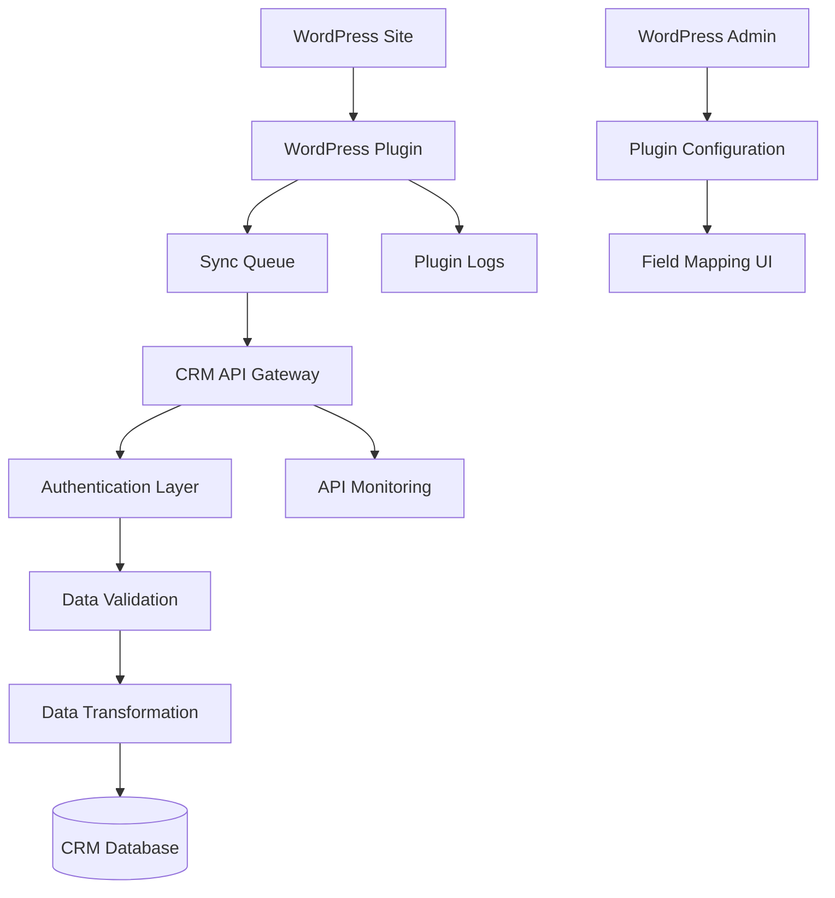

# WordPress-to-CRM Integration Design Document

## Overview

The WordPress-to-CRM integration system consists of two main components: a WordPress plugin that captures and transmits data, and CRM API endpoints that receive and process the data. The system is designed for maximum compatibility, security, and reliability across diverse WordPress installations.

The integration supports real-time synchronization of customer data, orders, and products from WordPress/WooCommerce sites to the existing Next.js CRM system. The architecture emphasizes loose coupling, robust error handling, and flexible field mapping to accommodate various WordPress configurations.

## Architecture

### High-Level Architecture



### Component Architecture

**WordPress Plugin Layer:**
- Event Listeners (user registration, order creation)
- Field Mapping Engine
- Data Serialization
- Queue Management
- HTTP Client with retry logic
- Admin Interface

**CRM API Layer:**
- Authentication middleware
- Request validation
- Data transformation
- Database operations
- Response formatting
- Error handling

### Data Flow

1. **Event Capture**: WordPress actions trigger plugin event listeners
2. **Data Mapping**: Plugin applies configured field mappings to extract relevant data
3. **Queue Processing**: Data is queued for asynchronous transmission
4. **API Request**: Plugin sends HTTP POST request to CRM endpoints
5. **Authentication**: CRM validates API key and optional HMAC signature
6. **Data Validation**: CRM validates payload against JSON schemas
7. **Data Processing**: CRM transforms and stores data in existing database structure
8. **Response**: CRM returns success/error response to WordPress

## Components and Interfaces

### WordPress Plugin Components

**1. Main Plugin File (`wordpress-crm-integration.php`)**
- Plugin header and activation hooks
- Core initialization and dependency loading
- WordPress hooks registration

**2. Admin Interface (`admin/class-admin.php`)**
- Settings page rendering
- Field mapping interface
- Connection testing
- Sync status dashboard

**3. Event Handlers (`includes/class-event-handlers.php`)**
- User registration handler
- WooCommerce order handler
- Product update handler

**4. Field Mapper (`includes/class-field-mapper.php`)**
- Dynamic field discovery
- Mapping configuration storage
- Data extraction based on mappings

**5. API Client (`includes/class-api-client.php`)**
- HTTP request handling
- Authentication header management
- Retry logic implementation
- Error response processing

**6. Queue Manager (`includes/class-queue-manager.php`)**
- Asynchronous job queuing
- Cron-based processing
- Failure handling and retries

### CRM API Components

**1. Integration Endpoints**
- `/api/integrations/wordpress/customers` - Customer data endpoint
- `/api/integrations/wordpress/orders` - Order data endpoint  
- `/api/integrations/wordpress/products` - Product data endpoint

**2. Authentication Middleware**
- API key validation
- HMAC signature verification (optional)
- Rate limiting

**3. Validation Layer**
- JSON schema validation
- Required field checking
- Data type validation

**4. Data Transformation**
- WordPress-to-CRM field mapping
- UUID generation
- Tenant assignment

## Data Models

### WordPress Plugin Configuration Schema

```typescript
interface PluginConfig {
  crm_url: string;
  api_key: string;
  tenant_key?: string;
  sync_enabled: {
    customers: boolean;
    orders: boolean;
    products: boolean;
  };
  field_mappings: {
    customer: CustomerFieldMapping;
    order: OrderFieldMapping;
    product: ProductFieldMapping;
  };
  retry_settings: {
    max_attempts: number;
    backoff_multiplier: number;
  };
}

interface CustomerFieldMapping {
  email: string;          // WordPress field name
  first_name: string;
  last_name: string;
  phone: string;
  company: string;
  address: string;
  city: string;
  country: string;
}
```

### CRM API Schemas

**Customer Schema:**
```typescript
interface WordPressCustomer {
  source: 'wordpress';
  wordpress_user_id: number;
  email: string;
  first_name?: string;
  last_name?: string;
  phone?: string;
  company_name?: string;
  address?: string;
  city?: string;
  state?: string;
  country?: string;
  postal_code?: string;
  registration_date: string;
  metadata?: Record<string, any>;
}
```

**Order Schema:**
```typescript
interface WordPressOrder {
  source: 'wordpress';
  wordpress_order_id: number;
  customer_email: string;
  total_amount: number;
  currency: string;
  status: string;
  order_date: string;
  billing_info: BillingInfo;
  line_items: OrderLineItem[];
  metadata?: Record<string, any>;
}

interface OrderLineItem {
  product_name: string;
  quantity: number;
  unit_price: number;
  total_price: number;
  sku?: string;
}
```

**Product Schema:**
```typescript
interface WordPressProduct {
  source: 'wordpress';
  wordpress_product_id: number;
  name: string;
  description?: string;
  sku?: string;
  price?: number;
  currency?: string;
  category?: string;
  status: 'active' | 'inactive';
  metadata?: Record<string, any>;
}
```

### CRM Database Integration

The integration will extend existing CRM tables:

**Customers Table Extensions:**
- Add `wordpress_user_id` field for reference tracking
- Add `source` field to identify WordPress-originated records
- Utilize existing fields: `email`, `first_name`, `last_name`, `phone`, etc.

**New Integration Tracking Table:**
```sql
CREATE TABLE wordpress_sync_log (
  id VARCHAR(36) PRIMARY KEY,
  wordpress_site_url VARCHAR(255),
  entity_type ENUM('customer', 'order', 'product'),
  wordpress_entity_id INT,
  crm_entity_id VARCHAR(36),
  sync_status ENUM('success', 'failed', 'pending'),
  error_message TEXT,
  created_at TIMESTAMP DEFAULT CURRENT_TIMESTAMP,
  updated_at TIMESTAMP DEFAULT CURRENT_TIMESTAMP ON UPDATE CURRENT_TIMESTAMP
);
```

## Error Handling

### WordPress Plugin Error Handling

**1. Connection Errors**
- Network timeouts: Implement exponential backoff retry
- DNS resolution failures: Log and notify admin
- SSL certificate issues: Provide clear error messages

**2. Authentication Errors**
- Invalid API key: Disable sync and notify admin
- Expired credentials: Attempt refresh if supported

**3. Data Validation Errors**
- Missing required fields: Log specific field errors
- Invalid data formats: Transform data or skip with warning

**4. Rate Limiting**
- HTTP 429 responses: Implement backoff and retry
- Queue overflow: Prioritize critical data types

### CRM API Error Handling

**1. Authentication Failures**
- Return HTTP 401 with specific error codes
- Log failed authentication attempts
- Implement rate limiting for security

**2. Validation Errors**
- Return HTTP 400 with field-specific error details
- Provide clear error messages for debugging
- Log validation failures for monitoring

**3. Database Errors**
- Handle duplicate key constraints gracefully
- Implement transaction rollback for data integrity
- Return HTTP 500 for unexpected database errors

**4. System Errors**
- Implement circuit breaker pattern for external dependencies
- Graceful degradation during high load
- Comprehensive error logging and monitoring

## Testing Strategy

### WordPress Plugin Testing

**Unit Tests:**
- Field mapping logic validation
- Data transformation accuracy
- Queue management functionality
- API client request formatting

**Integration Tests:**
- WordPress hook integration
- WooCommerce compatibility
- Database option storage
- Admin interface functionality

**Compatibility Tests:**
- Multiple WordPress versions (5.0+)
- Various theme compatibility
- Plugin conflict detection
- WooCommerce version compatibility

### CRM API Testing

**Unit Tests:**
- Authentication middleware
- Data validation logic
- Database operations
- Response formatting

**Integration Tests:**
- End-to-end data flow
- Database transaction integrity
- Error handling scenarios
- Performance under load

**Security Tests:**
- API key validation
- HMAC signature verification
- SQL injection prevention
- Rate limiting effectiveness

## Correctness Properties

*A property is a characteristic or behavior that should hold true across all valid executions of a system-essentially, a formal statement about what the system should do. Properties serve as the bridge between human-readable specifications and machine-verifiable correctness guarantees.*

### Property Reflection

After analyzing all acceptance criteria, several properties can be consolidated to eliminate redundancy:

- Plugin installation and activation properties (1.1, 1.2) can be combined into a comprehensive installation property
- Field mapping UI properties (2.1, 2.2) can be combined into a single UI rendering property  
- Data validation properties (4.2, 7.2) overlap and can be unified
- Logging properties (5.1, 5.2) can be combined into comprehensive logging behavior
- Compatibility properties (6.1, 6.2, 6.3) can be unified into a general compatibility property

### WordPress Plugin Properties

**Property 1: Plugin Installation and Activation**
*For any* WordPress installation (version 5.0+), installing and activating the plugin should result in a functional admin interface without theme modifications or direct database access
**Validates: Requirements 1.1, 1.2**

**Property 2: Configuration Interface Completeness**
*For any* plugin activation, the admin settings page should contain all required configuration elements (CRM URL, API key, sync toggles) and field mapping dropdowns for each CRM field requirement
**Validates: Requirements 1.3, 2.1**

**Property 3: Dynamic Field Discovery**
*For any* WordPress installation, the field mapping interface should dynamically populate with available WordPress fields, user meta, and WooCommerce fields (when available), hiding WooCommerce options when not installed
**Validates: Requirements 2.2, 2.3**

**Property 4: Configuration Persistence**
*For any* valid configuration data, saving settings should result in proper storage in WordPress options table and successful retrieval on subsequent loads
**Validates: Requirements 2.4**

**Property 5: Connection Validation**
*For any* CRM credentials provided, the plugin should validate connectivity and display appropriate success or error messages, preventing sync when credentials are invalid
**Validates: Requirements 1.4, 1.5, 2.5**

**Property 6: Event Capture and Data Preparation**
*For any* WordPress user registration or WooCommerce order creation, the plugin should capture the event and prepare data according to configured field mappings
**Validates: Requirements 3.1, 3.2**

**Property 7: API Communication**
*For any* sync event, the plugin should transmit properly formatted JSON data to the correct CRM API endpoint with appropriate authentication headers
**Validates: Requirements 3.3**

**Property 8: Error Handling and Retry Logic**
*For any* API failure or data validation error, the plugin should log detailed error information, implement exponential backoff retry logic, and continue WordPress operations without disruption
**Validates: Requirements 3.4, 3.5**

**Property 9: Comprehensive Logging**
*For any* sync operation, the plugin should log all API requests with timestamps, payload summaries, response status, and detailed error information when failures occur
**Validates: Requirements 5.1, 5.2**

**Property 10: Admin Monitoring Interface**
*For any* admin interface access, recent sync activity and error summaries should be displayed, with failure threshold monitoring that disables sync and notifies administrators when exceeded
**Validates: Requirements 5.3, 5.4, 5.5**

**Property 11: Cross-Environment Compatibility**
*For any* WordPress installation (different versions, themes, plugins), the plugin should function correctly without conflicts, maintaining WooCommerce detection and preserving configurations during updates
**Validates: Requirements 6.1, 6.2, 6.3, 6.4, 6.5**

**Property 12: Asynchronous Processing and Performance**
*For any* high-volume sync scenario, the plugin should queue requests for asynchronous processing, implement proper batching, handle rate limits with backoff strategies, and clean up temporary data
**Validates: Requirements 8.1, 8.2, 8.3, 8.4, 8.5**

### CRM API Properties

**Property 13: API Authentication**
*For any* incoming WordPress request, the CRM system should validate API keys and optional HMAC signatures, rejecting unauthorized requests with appropriate HTTP status codes
**Validates: Requirements 4.1, 7.4**

**Property 14: Data Validation and Schema Compliance**
*For any* customer, order, or product data received, the CRM system should validate against defined JSON schemas and return structured error responses for validation failures
**Validates: Requirements 4.2, 4.5, 7.2**

**Property 15: Customer Data Processing**
*For any* valid customer data, the CRM system should assign appropriate tenant keys, generate UUID identifiers, and update existing records when duplicates are detected rather than creating new ones
**Validates: Requirements 4.3, 4.4**

**Property 16: RESTful API Design**
*For any* API endpoint interaction, the CRM system should follow RESTful conventions with appropriate HTTP methods, status codes, and consistent JSON response structure
**Validates: Requirements 7.1, 7.3**

### Integration Properties

**Property 17: End-to-End Data Flow**
*For any* complete sync operation, data should flow from WordPress event capture through field mapping, API transmission, CRM validation, and database storage while maintaining data integrity throughout
**Validates: Multiple requirements across the entire flow**

**Property 18: WordPress-to-CRM Field Mapping Round Trip**
*For any* configured field mapping, data extracted from WordPress should be correctly transformed and stored in the corresponding CRM fields, maintaining data accuracy and completeness
**Validates: Requirements 2.4, 3.1, 3.2, 4.2**

## Testing Strategy

### Dual Testing Approach

The testing strategy employs both unit testing and property-based testing to ensure comprehensive coverage:

- **Unit tests** verify specific examples, edge cases, and integration points
- **Property tests** verify universal properties across all valid inputs
- Together they provide complete coverage: unit tests catch concrete bugs, property tests verify general correctness

### Property-Based Testing Requirements

- **Testing Framework**: Use PHPUnit with Eris for PHP property-based testing in WordPress plugin, and Jest with fast-check for TypeScript property-based testing in CRM APIs
- **Test Configuration**: Each property-based test must run a minimum of 100 iterations
- **Test Tagging**: Each property-based test must include a comment with the format: `**Feature: wordpress-crm-integration, Property {number}: {property_text}**`
- **Property Implementation**: Each correctness property must be implemented by a single property-based test

### WordPress Plugin Testing

**Unit Tests:**
- WordPress hook integration verification
- Admin interface rendering with specific configurations
- Field mapping logic with known WordPress installations
- API client request formatting with sample data
- Error handling with specific failure scenarios

**Property-Based Tests:**
- Plugin installation across random WordPress configurations
- Field mapping with randomly generated WordPress field sets
- Data extraction with random user registration and order data
- API communication with various credential and payload combinations
- Error handling and retry logic with random failure patterns

### CRM API Testing

**Unit Tests:**
- Authentication middleware with specific API keys
- JSON schema validation with known valid/invalid payloads
- Database operations with sample customer/order data
- Response formatting with specific success/error scenarios

**Property-Based Tests:**
- API authentication with randomly generated keys and signatures
- Data validation with randomly generated customer/order/product data
- Database operations with random duplicate detection scenarios
- RESTful compliance across random endpoint interactions

### Integration Testing

**End-to-End Tests:**
- Complete WordPress-to-CRM data synchronization flows
- Field mapping accuracy across various WordPress configurations
- Error recovery and retry mechanisms under random failure conditions
- Performance testing with varying load patterns

**Security Tests:**
- API key validation with malicious input attempts
- HMAC signature verification with tampered requests
- SQL injection prevention with crafted payloads
- Rate limiting effectiveness under attack scenarios